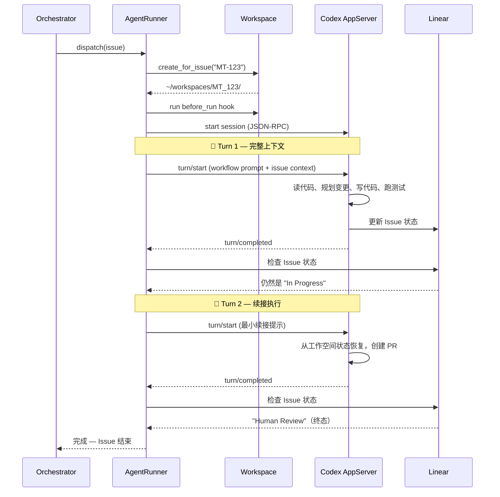

# 📚 AI Agent 项目研究报告 #270 — OpenAI Symphony：自主编码 Agent 编排服务

## 一、项目基本信息

- **项目名称：** Symphony
- **GitHub：** https://github.com/openai/symphony
- **开发组织：** OpenAI（官方发布）
- **开源协议：** Apache License 2.0
- **首次发布：** 2026 年 2 月 26 日（创建），2026 年 3 月 5 日正式公开宣布
- **核心定位：** 将项目工作转化为隔离的、自主的实现运行——让团队管理工作，而不是监督编码 Agent
- **GitHub Stars：** 14,916+ ⭐（截至 2026 年 4 月 11 日，发布约 6 周内获得）
- **主要语言：** Elixir（基于 Erlang/BEAM/OTP 虚拟机）
- **参考实现：** Elixir/OTP + Phoenix LiveView Dashboard
- **规范文档：** SPEC.md（语言无关的编排服务规范）
- **官方文档：** https://mintlify.com/openai/symphony/architecture/overview
- **最后活跃：** 2026 年 3 月 27 日

---

## 二、项目背景与动机

### 2.1 核心问题：从"AI 辅助编码"到"AI 自主交付"的鸿沟

Symphony 诞生的背景是 AI 编码助手在过去两年间经历了从"增强自动补全"到"真正的代码协作者"的演进。但一个**持久的鸿沟**依然存在：

> **"帮助人写代码的 AI" ≠ "在你睡觉时交付功能的 AI"**

当前痛点：

| 痛点 | 描述 |
|------|------|
| **人工监督瓶颈** | 现有编码 Agent 需要人类持续监督——启动任务、检查进度、处理错误 |
| **并发管理缺失** | 同时处理多个 Issue 时，缺乏统一的调度和资源分配机制 |
| **工作空间污染** | 多个 Agent 在同一代码库上并行工作时互相干扰 |
| **状态同步困难** | Agent 完成的工作与项目管理工具（Jira/Linear）的状态不同步 |
| **失败恢复原始** | Agent 执行失败后缺乏自动重试和退避策略 |
| **安全性不可控** | Agent 对文件系统的访问权限缺乏精细控制 |

### 2.2 OpenAI 的解决思路

> **"把项目工作变成隔离的、自主的实现运行（Implementation Runs）"**

Symphony 不是另一个 Agent 框架，不是带工具的聊天机器人。它是一个**长期运行的编排服务（Orchestration Service）**，核心理念是：

1. **工作即代码（Work as Code）：** 团队规则编码在 WORKFLOW.md 中，版本化、可审查
2. **Issue → PR 全自动化：** 从 Linear 看板上的 Todo 到 GitHub 上的合并 PR，全程无人值守
3. **隔离执行：** 每个 Issue 拥有独立的工作空间，互不干扰
4. **容错设计：** 基于 OTP 的进程隔离和监督重启，一个 Agent 崩溃不影响其他

### 2.3 关键里程碑

| 时间 | 事件 |
|------|------|
| 2026.02.26 | GitHub 仓库创建 |
| 2026.03.05 | OpenAI 正式公开发布，同时 GitHub Copilot Coding Agent for Jira 进入公测 |
| 2026.03 | 发布 SPEC.md 语言无关规范 + Elixir 参考实现 |
| 2026.03.27 | 最后一次代码更新（持续迭代中） |

**值得注意的是：** Symphony 与 GitHub Copilot Coding Agent for Jira 在**同一天**（2026年3月5日）发布，标志着"Ticket-to-PR"自主编码赛道正式进入白热化竞争阶段。

---

## 三、架构设计

### 3.1 整体架构：六层分离

```
┌─────────────────────────────────────────────────────────────────────┐
│                        Linear Issue Tracker                         │
│   ┌──────┐  ┌───────────┐  ┌──────────┐                            │
│   │ Todo │  │ In Progress│  │ Done/Closed│                          │
│   └──┬───┘  └─────┬─────┘  └────▲─────┘                            │
│      │            │             │                                   │
│      │  每30秒轮询  │    PR+状态更新                                  │
└──────┼────────────┼─────────────┼───────────────────────────────────┘
       │            │             │
       ▼            ▼             │
┌─────────────────────────────────────────────────────────────────────┐
│                   Symphony Service (Elixir/OTP)                     │
│                                                                     │
│  ┌─────────────────────────────────────────────────────────────┐   │
│  │              Orchestrator (GenServer 轮询循环)                │   │
│  │  · 状态机管理     · 并发控制     · 重试调度                    │   │
│  │  · Token 用量统计  · 速率限制检测                               │   │
│  └──────────────────────────┬──────────────────────────────────┘   │
│                             │                                       │
│  ┌──────────────────────────▼──────────────────────────────────┐   │
│  │              WorkflowStore (配置热重载)                       │   │
│  │  · WORKFLOW.md 解析  · YAML front matter                     │   │
│  └──────────────────────────┬──────────────────────────────────┘   │
│                             │                                       │
│  ┌──────────────────────────▼──────────────────────────────────┐   │
│  │           Status Dashboard (Phoenix LiveView)                 │   │
│  │  · 实时状态监控    · Token 追踪    · 吞吐量图表               │   │
│  └─────────────────────────────────────────────────────────────┘   │
└──────────────────────────────────────┬──────────────────────────────┘
                                       │
          ┌────────────────────────────┼────────────────────────────┐
          │                            │                            │
          ▼                            ▼                            ▼
┌─────────────────┐         ┌─────────────────┐         ┌─────────────────┐
│  AgentRunner #1  │         │  AgentRunner #2  │         │  AgentRunner #N  │
│  (多Turn执行器)   │         │  (多Turn执行器)   │         │  (多Turn执行器)   │
└────────┬─────────┘         └────────┬─────────┘         └────────┬─────────┘
         │                           │                           │
         ▼                           ▼                           ▼
┌─────────────────┐         ┌─────────────────┐         ┌─────────────────┐
│  Workspace MT-123│         │  Workspace MT-124│         │  Workspace MT-125│
│  git clone+deps  │         │  git clone+deps  │         │  git clone+deps  │
└────────┬─────────┘         └────────┬─────────┘         └────────┬─────────┘
         │                           │                           │
         ▼                           ▼                           ▼
┌─────────────────┐         ┌─────────────────┐         ┌─────────────────┐
│ Codex AppServer │         │ Codex AppServer │         │ Codex AppServer │
│ JSON-RPC 2.0    │         │ JSON-RPC 2.0    │         │ JSON-RPC 2.0    │
│ over stdio      │         │ over stdio      │         │ over stdio      │
└─────────────────┘         └─────────────────┘         └─────────────────┘
```

### 3.2 六层架构详解

| 层次 | 组件 | 职责 |
|------|------|------|
| **策略层** | WORKFLOW.md | 团队规则编码——YAML 配置 + Markdown Agent 提示词模板 |
| **配置层** | WorkflowStore | 类型安全的运行时配置解析，支持热重载 |
| **协调层** | Orchestrator (GenServer) | 轮询、并发控制、重试调度、Token 计费 |
| **执行层** | AgentRunner + Workspace | 工作空间管理和 Agent 子进程管理 |
| **集成层** | Linear GraphQL API | Issue 状态读写、评论、阻塞关系查询 |
| **可观测层** | Phoenix LiveView + 结构化日志 | 实时 Dashboard + JSON API + 日志追踪 |

### 3.3 核心组件深度解析

#### ① Orchestrator —— 状态机驱动的调度中枢

Symphony 的心脏是一个运行在 BEAM VM 上的 GenServer 进程，维护完整的内存状态机：

```elixir
%State{
  poll_interval_ms: 30000,          # 轮询间隔 30 秒
  max_concurrent_agents: 10,        # 最大并发 Agent 数
  running: %{},                     # 正在执行的 Issue 映射
  completed: MapSet.new(),          # 已完成集合（防止重复派发）
  claimed: MapSet.new(),            # 重试队列中的 Issue
  retry_attempts: %{},              # 指数退避追踪
  codex_totals: %{...},             # Token 用量统计
  codex_rate_limits: nil,           # 速率限制状态
}
```

**调度循环流程：**

```
轮询定时器触发
    ↓
从 Linear 获取候选 Issue 列表
    ↓
对每个 Issue：
  ├─ 已在运行或已完成？→ 跳过
  ├─ 达到并发上限？→ 排队等待
  └─ 可以派发？→ 分配给 AgentRunner
       ↓
  Task.async 启动监控执行
       ↓
  Agent 完成？→ 移入 completed 集合
  Agent 失败？→ 加入重试队列 + 指数退避
       ↓
等待下一轮轮询
```

**关键设计——调和模式（Reconciliation Pattern）：**
- Orchestrator **从不假设** Issue 的状态
- 每次轮询都从 Linear **重新获取**最新状态
- 如果一个"In Progress"的 Issue 被外部（如 PM 手动）移到"Cancelled"
- Symphony **立即检测到**并停止对应 Agent
- **Agent 不与人类对抗**

**指数退避重试机制：**
```
基础延迟: 10 秒
公式: min(10s × 2^attempts, 300s)
序列: 10s → 20s → 40s → 80s → 160s → 300s → 300s → ...
```

#### ② AgentRunner —— 多 Turn 自主执行引擎

每个被派发的 Issue 获得独立的 AgentRunner 进程，这是真正"干活"的地方：



**多 Turn 续接模式——Symphony 最聪明的设计之一：**

| Turn | Agent 收到的内容 | 设计意图 |
|------|-----------------|---------|
| **Turn 1** | WORKFLOW.md 渲染后的完整提示词 + Issue 标题/描述 | 让 Agent 全面理解任务 |
| **Turn 2+** | 最小续接提示："你仍在处理 MT-123，从上次中断处继续" | 利用工作空间持久状态，避免重复分析 |

**为什么这很有效：**
- 工作空间是持久的——Agent 能看到之前的 commit、半成品代码、测试结果
- 无需重新分析整个问题，直接从中断点继续
- 默认最多 20 个 Turn（可配置），足以完成复杂的多文件功能开发

#### ③ Codex AppServer 通信协议

Symphony 与 Codex 之间使用 **JSON-RPC 2.0 over stdio** 通信（不是 HTTP）：

```json
// Symphony → Codex：启动一个 Turn
{
  "method": "turn/start",
  "id": 3,
  "params": {
    "prompt": "You are working on MT-123: Add rate limiting...",
    "threadId": "thread-abc-123"
  }
}

// Codex → Symphony：请求调用工具
{
  "method": "item/tool/call",
  "id": 100,
  "params": {
    "tool": "linear_graphql",
    "arguments": {
      "query": "mutation { issueUpdate(...) { success } }"
    }
  }
}

// Symphony → Codex：返回工具结果
{
  "id": 100,
  "result": {
    "success": true,
    "output": "{\"data\":{\"issueUpdate\":{\"success\":true}}}"
  }
}
```

**动态工具注入 `linear_graphql`：**
- Symphony 向每个 Codex 会话注入一个 `linear_graphql` 工具
- Agent 可以直接查询和修改 Linear 数据（更新状态、发表评论、检查阻塞关系）
- **无需 Symphony 充当每个交互的中介**——Agent 拥有直接的 Issue 管理能力

#### ④ Workspace 隔离系统

每个 Issue 获得完全隔离的工作空间目录：

```
Issue: "MT-123"
    ↓ （清洗标识符：只保留字母数字+点+连字符）
Workspace: ~/workspaces/MT_123/
    ├── .git/
    ├── src/
    ├── tests/
    ├── node_modules/
    └── ...
```

**三级安全防护：**

| 安全措施 | 实现方式 |
|---------|---------|
| **路径验证** | 每个工作空间路径必须解析到 WORKSPACE_ROOT 下 |
| **符号链接检测** | 通过 canonical path 比较检测 symlink 逃逸 |
| **遍历攻击防护** | 拒绝任何包含 `../` 或绝对路径逃逸的操作 |

**Hook 系统（生命周期钩子）：**

| Hook 触发时机 | 典型用途 | 超时默认值 |
|-------------|---------|-----------|
| `after_create` | git clone、npm install、依赖安装 | 30 秒 |
| `before_run` | 同步最新代码、重置状态 | 30 秒 |
| `after_run` | 清理、日志记录、产物收集 | 30 秒 |
| `before_remove` | 工作空间清理时的预处理 | 30 秒 |

所有 Hook 都有超时保护，防止挂起的 Agent 阻塞系统。

#### ⑤ WORKFLOW.md —— 配置即代码

这是 Symphony 最具创新性的设计决策——**所有配置集中在一个 Markdown 文件中**：

```yaml
---
tracker:
  kind: linear
  api_key: $LINEAR_API_KEY
  project_slug: my-project-abc123
  active_states: [Todo, In Progress]
  terminal_states: [Done, Closed, Cancelled]

polling:
  interval_ms: 30000

workspace:
  root: ~/code/symphony-workspaces

hooks:
  after_create: |
    git clone https://github.com/my-org/my-repo.git .
    npm install

agent:
  max_concurrent_agents: 10
  max_turns: 20
  max_concurrent_agents_by_state:
    "human review": 1    # 串行审查——无竞态条件
    "merging": 2          # 有限合并并行度
    "in progress": 10     # 全并行开发

codex:
  command: codex --model gpt-5.3-codex app-server
  approval_policy: never
  thread_sandbox: workspace-write
---

You are an autonomous software engineer working on {{ issue.identifier }}: {{ issue.title }}.

## Context
{{ issue.description }}

## Instructions
1. Read the codebase and understand the existing patterns
2. Implement the requested changes
3. Write tests for your changes
4. Create a pull request with a clear description
5. Update the Linear issue state when complete
```

**设计的精妙之处：**
- **版本化：** WORKFLOW.md 随代码一起提交到 Git，每次修改都有完整历史
- **可审查：** Agent 行为变更以 PR 形式呈现，团队可以 Code Review
- **团队拥有：** 不再是散落的环境变量和配置文件，而是单一事实来源
- **模板变量：** 支持 `{{ issue.identifier }}`、`{{ issue.title }}`、`{{ issue.description }}` 等动态渲染

#### ⑥ 分布式执行 —— SSH Workers

Symphony 支持跨机器分布式执行：

```yaml
worker:
  ssh_hosts:
    - "worker1.example.com:22"
    - "worker2.example.com:2222"
  max_concurrent_agents_per_host: 5
```

**故障转移逻辑：**
1. 尝试第一个 Host
2. 失败则 fallback 到下一个
3. 所有 Host 都失败则全局重试
4. 每个 Worker 维护独立的工作空间根目录
5. Symphony 远程处理工作空间创建、Codex 进程生成、SSH 生命周期管理

#### ⑦ Issue 生命周期状态机

```
stateDiagram-v2
    [*] --> Candidate: Issue 处于活跃状态
    Candidate --> Dispatched: 未达并发上限
    Candidate --> Waiting: 达到并发上限
    Waiting --> Candidate: 有可用槽位

    Dispatched --> Running: AgentRunner 启动
    Running --> TurnComplete: Turn 完成

    TurnComplete --> ContinuationCheck: 检查 Issue 状态
    ContinuationCheck --> Running: 仍活跃 + 有剩余 Turn
    ContinuationCheck --> Completed: 到达终态
    ContinuationCheck --> Completed: 达到最大 Turn 数

    Running --> Failed: 执行出错
    Failed --> RetryQueue: 加入退避队列
    RetryQueue --> Candidate: 退避到期

    Completed --> [*]
```

### 3.4 内置 Skills（技能）

Symphony 附带仓库本地的技能扩展：

| 技能 | 功能描述 |
|------|---------|
| **land** | 监控 PR 的 CI 状态、冲突、审查意见——CI 全绿后 squash merge（含 Python 辅助脚本 `land_watch.py`） |
| **pull** | 拉取最新 main、合并并解决冲突 |
| **push** | Commit 并 push，含 auth 回退逻辑 |
| **commit** | 创建符合团队规范的逻辑原子提交 |
| **linear** | 直接的 Linear GraphQL 操作（Issue 状态管理） |
| **debug** | 故障排查和堆栈跟踪分析 |

**land 技能特别值得注意：**
- 包含 `land_watch.py` Python 辅助脚本
- 监控 PR 的 CI 完成状态
- 聚合 check 结果
- **过滤 Codex 审查评论与人类审查评论**（区分 AI 和人类的反馈）
- 自动处理合并冲突
- 这是一个**完全自治的合并流水线**

---

## 四、技术能力与生态

### 4.1 为什么选择 Elixir/OTP？

这不是 cosmetic 选择，而是架构决策的核心依据：

| BEAM VM 特性 | 对 Symphony 的价值 |
|-------------|-------------------|
| **OTP Supervision Trees** | 一个 Agent 崩溃 → 监督重启 + 完整错误上下文，其他 Agent 完全不受影响 |
| **进程隔离** | 每个 AgentRunner 是轻量级 BEAM 进程（非 OS 线程），内存隔离 |
| **容错原生** | "Let it crash" 哲学——崩溃是预期的，重启是自动的 |
| **热代码 reload** | 开发期间无需停止正在运行的 subagent 即可更新代码 |
| **GenServer** | Orchestrator 作为有状态的长时间运行进程的理想抽象 |
| **高并发** | BEAM 的 Actor 模型天然适合管理数十个并发 Agent |

**对比其他语言的实现成本：**
- Python/TypeScript 要达到同等级别的进程隔离和故障恢复 → **需要数月工程量**
- Elixir → **语言内置的一等公民特性**

### 4.2 安全与沙箱体系

Symphony 实现了多层安全控制：

#### 审批策略（Approval Policy）

| 策略 | 行为 |
|------|------|
| `never` | 全自动批准，无需人工干预（典型自主部署选择） |
| `on-failure` | 仅在操作失败时要求审批 |
| `on-request` | Agent 主动请求时需要审批 |
| `untrusted` | 每次操作都需要明确批准 |
| `reject`（对象形式） | 细粒度拒绝特定类别：sandbox_approval / rules / mcp_elicitations |

#### 文件系统沙箱策略

| 策略 | 权限范围 |
|------|---------|
| `read-only` | Agent 只能读取，不能修改任何内容 |
| `workspace-write` | Agent 只能在其工作空间目录内写入（推荐） |
| `danger-full-access` | 无限制访问（⚠️ 谨慎使用） |

#### 其他安全措施

- **非交互模式：** Agent 无法因等待人类输入而卡住——返回标准"无人类可用"响应后继续自主运行
- **路径安全：** 目录遍历防护、symlink 逃逸检测、工作空间根边界强制
- **Hook 超时：** 所有生命周期钩子有 30 秒默认超时

### 4.3 可观测性

#### Phoenix LiveView Dashboard（可选启用）

```
./bin/symphony ./WORKFLOW.md --port 4000
```

提供以下实时监控能力：

| 功能 | 说明 |
|------|------|
| **运行中 Issue** | 显示阶段、运行时长、Token 用量 |
| **已完成/重试中 Issue** | 历史记录和重试状态 |
| **吞吐量图表** | Sparkline 迷你图 |
| **Token 追踪** | 每个 Agent 的 input/output Token 统计 |

#### JSON API

| 端点 | 用途 |
|------|------|
| `/` | LiveView Dashboard |
| `/api/v1/state` | 全局状态 JSON |
| `/api/v1/<issue_identifier>` | 单个 Issue 详情 |
| `/api/v1/refresh` | 手动触发重新轮询 |

#### 结构化日志

每个事件都携带以下标签：
- `issue_id`、`issue_identifier`、`session_id`
- `worker_host`、`workspace`

便于接入日志聚合系统进行全链路追踪。

### 4.4 与 OpenAI 生态的集成关系

```
OpenAI 产品线定位：

Codex（CLI 工具）
  ↓ 提供 App Server 模式
Symphony（编排服务）← 本项目
  ↓ 调度和管理
Codex App Server（执行引擎）
  ↓ 实际执行
GPT-5.3-Codex（推理模型）
```

**Symphony 是 OpenAI "Harness Engineering" 理念的自然延伸：**
- Phase 1：Harness Engineering —— 让代码库适合 Agent 工作
- Phase 2：Symphony —— 从"管理 Agent"进化到"管理工作"

---

## 五、与其他主流框架对比

| 维度 | **Symphony** | **ElizaOS** (#269) | **Agno** (#268) | **DeerFlow** (#001) | **Maestro** (#266) |
|------------|----------|-------------------|---------------|-------------------|-----------------|
| **语言** | **Elixir** | TypeScript | Python | Python | TypeScript |
| **定位** | 编排服务 | Web3 Agent OS | 全栈运行时 | SuperAgent Harness | 编排指挥中心 |
| **核心范式** | Issue→PR 自主流水线 | Plugin OS + Character | Framework+Runtime+CP | Middleware 管道 | 中央编排器 |
| **Agent 模型** | Codex (App Server) | 可插拔 LLM | 10+ LLM | 动态模型选择 | 可配置 |
| **通信协议** | **JSON-RPC 2.0 stdio** | 内存/插件 API | 流式 API | HTTP/WebSocket | 事件驱动 |
| **隔离机制** | **Workspace 隔离** | Room 隔离 | 会话隔离 | Thread 隔离 | Namespace |
| **并发模型** | **OTP Actor** | 事件循环 | 异步任务 | 中间件管道 | 图调度 |
| **容错能力** | ⭐⭐⭐⭐⭐ **OTP 原生** | ⭐⭐⭐ | ⭐⭐⭐ | ⭐⭐⭐ | ⭐⭐⭐ |
| **配置方式** | **WORKFLOW.md (CaaS)** | JS/TS Config | Python Config | YAML/Python | TS Config |
| **Issue Tracker** | ✅ **Linear 原生** | ❌ | ❌ | ❌ | ⚠️ 插件 |
| **分布式执行** | ✅ **SSH Workers** | ❌ | ⚠️ 有限 | ⚠️ Subagent | ⚠️ 分布式 |
| **沙箱安全** | ⭐⭐⭐⭐⭐ 多层 | ⭐⭐⭐ TEE | ⭐⭐⭐ | ⭐⭐⭐⭐ Sandbox | ⭐⭐⭐ |
| **Dashboard** | ✅ Phoenix LiveView | ✅ React+Tauri | ✅ AgentOS | ✅ Next.js | ✅ Web UI |
| **学习曲线** | ⭐⭐⭐⭐ 高（需 Elixir） | ⭐⭐⭐ 中 | ⭐⭐ 低 | ⭐⭐⭐⭐ 高 | ⭐⭐⭐ 中 |
| **成熟度** | ⭐⭐⭐ Engineering Preview | ⭐⭐⭐⭐⭐ 生产级 | ⭐⭐⭐⭐ 生产级 | ⭐⭐⭐⭐⭐ 生产级 | ⭐⭐⭐⭐ 成熟 |

**Symphony 的独特生态位：**
- **唯一的"Elixir/OTP Agent 编排服务"**——利用 BEAM VM 的容错特性
- **唯一的"Issue Tracker Native"框架**——Linear 深度集成而非事后适配
- **唯一的"配置即代码（WORKFLOW.md）"方案**——Agent 行为随代码版本化管理
- **唯一的"纯编排服务"定位**——不包含 LLM 调用逻辑，专注调度和基础设施
- **OpenAI 官方出品**——与 Codex 生态深度整合

---

## 六、技术亮点分析

### 6.1 🎼 "让团队管理工作，而不是监督 Agent"——范式转移

这是 Symphony 最根本的理念创新。传统模式下：

```
传统模式：
开发者 → 写 Ticket → 自己做 或 → 启动 Agent → 监督 Agent → 检查结果 → 合并

Symphony 模式：
开发者 → 写 Ticket → （去喝咖啡）
         Symphony 自动：派发 → 执行 → 测试 → PR → CI → Merge → 更新 Ticket
```

**本质变化：** 人类的角色从"监工"变成了"规则制定者"。你不需要看 Agent 干活，你需要定义**什么样的活是好活**（通过 WORKFLOW.md）。

### 6.2 🔧 SPEC.md —— 语言无关的规范设计

Symphony 仓库中最具前瞻性的文件可能不是代码，而是 **SPEC.md**：

> **"用你最喜欢的编程语言让 coding agent 为你实现 Symphony"**

这意味着：
- Symphony 的**核心思想**与实现语言解耦
- 任何人可以用 Python、TypeScript、Go、Rust 重新实现
- Elixir 版本只是"参考实现"
- 这使 Symphony 更像一份**标准/协议**而非单纯的软件项目

**类比：** 就像 Kubernetes 定义了容器编排的标准（任何人可以写 conformant 的实现），Symphony 定义了 Agent 编排服务的标准。

### 6.3 🔄 多 Turn 续接——优雅的长任务处理

大多数 Agent 框架的交互模式是"单轮对话"——发一个 prompt，拿一个 response。Symphony 的多 Turn 模式：

```
Turn 1: "这是 Issue MT-123 的全部信息，请分析和实现"
  → Agent 读了代码库，写了初步实现，跑了测试
  
Turn 2: "继续 MT-123 的工作"
  → Agent 发现上次测试有一个 failed case，修复了它
  
Turn 3: "继续 MT-123 的工作"
  → Agent 创建了 PR，推送到远程
  
Turn 4: "继续 MT-123 的工作"
  → Agent 更新了 Linear 状态为 "Human Review"
```

**关键洞察：** Turn 2+ 的 prompt 极简（"继续工作"），因为**工作空间就是 Agent 的记忆**。Commit 历史、文件状态、测试结果——一切都在那里。

### 6.4 🛡️ 三级安全纵深防御

```
第一层：Approval Policy（审批策略）
  → 控制 Agent 能做什么操作（读/写/执行/网络）

第二层：Sandbox Policy（沙箱策略）
  → 控制 Agent 能访问哪些文件（只读/工作空间内/完全开放）

第三层：Path Validation（路径验证）
  → 技术层面阻止任何逃逸尝试（遍历/symlink/绝对路径）
  
第四层：Non-interactive Mode（非交互模式）
  → 确保 Agent 不会因等待输入而无限挂起
```

### 6.5 📡 调和模式——尊重人类的决定

Symphony 的 Orchestrator 每次轮询都从 Linear **重新获取** Issue 状态，而不是依赖内存中的缓存：

```
场景：PM 在 Symphony Agent 工作到一半时手动将 Issue 取消

传统框架：Agent 继续干活，完成后发现 Issue 已取消 → 浪费计算
Symphony：下次轮询（≤30秒内）检测到状态变为 Cancelled → 立即停止 Agent
```

**"Agent 不与人类对抗"**——这个简单原则避免了大量潜在的浪费和冲突。

### 6.6 🌐 分布式执行原生支持

从第一天起就支持 SSH Workers，而非后期添加：

```yaml
worker:
  ssh_hosts:
    - "worker1.example.com:22"
    - "worker2.example.com:2222"
  max_concurrent_agents_per_host: 5
```

对于需要大量并行编译/测试/CI 的团队，这意味着可以在多台机器上水平扩展 Agent 执行能力。

---

## 七、局限性与不足

### 7.1 技术局限

| 问题 | 影响 | 严重度 |
|------|------|--------|
| **Elixir 门槛** | 目标用户（大部分是 Python/TS 开发者）需要学习一门新语言来定制或调试 | 🔴 高 |
| **仅支持 Linear** | 目前只有 Linear 集成，Jira/Asana/Notion 用户无法使用 | 🔴 高 |
| **仅支持 Codex** | 编死在 OpenAI Codex 生态，无法使用 Claude Code、Cursor 等 | 🔴 高 |
| **Engineering Preview** | 明确标注为"低密度的工程预览"，不建议用于生产环境 | 🟡 中 |
| **无数据库** | 状态完全在内存中，重启后从 Linear 重建——丢失运行时历史 | 🟡 中 |
| **无标准基准测试** | 没有 GAIA/SWE-bench 等成绩，能力量化困难 | 🟡 中 |
| **SPEC.md 获取失败** | 规范文档无法稳定获取，可能仍在完善中 | 🟢 低 |
| **轮询模式** | 30 秒轮询（非 WebSocket/事件驱动），状态变更感知有延迟 | 🟢 低 |

### 7.2 生态与商业考量

1. **OpenAI Vendor Lock-in：** 虽然 Apache 2.0 开源，但深度绑定 Codex + GPT-5.3，切换成本极高
2. **与 Copilot Coding Agent 竞争：** 同天发布的 GitHub Copilot Coding Agent for Jira 直接面向更大的 Jira 用户群
3. **Google ADK 的威胁：** Google ADK 已扩展到 Linear/Jira/Asana/Notion 集成，且不绑定特定编码 Agent
4. **"配置即代码"的双刃剑：** WORKFLOW.md 虽然优雅，但 YAML front matter + Markdown 混合的格式对非技术人员不友好
5. **社区早期：** 14,916 Stars 但 Forks 仅 1,245，社区参与度相对较低（Fork/Star 比 8.3%）
6. **文档分散：** README、SPEC.md、Elixir README、Mintlify 文档、外部博客各有侧重

### 7.3 与同类产品的竞争格局

| 竞品 | 优势 | 相对 Symphony 的劣势 |
|------|------|---------------------|
| **GitHub Copilot Coding Agent** | Jira 集成、IDE 原生、海量用户基础 | 非开源、Vendor Lock-in（GitHub） |
| **Google ADK** | 多 Tracker 支持、模型无关、Google 云生态 | 较新、社区规模待观察 |
| **CodeRabbit Issue Planner** | 协作式 Prompt 审查、人类参与感强 | 非全自动、更偏辅助 |
| **DeerFlow** | 通用 SuperAgent、不限于编码 | 非 Issue Tracker 原生 |

---

## 八、适用场景与选型建议

### 最佳适用场景

1. **使用 Linear 的软件团队** —— 这是 Symphony 的主场，无缝集成
2. **已采用 OpenAI Codex 的团队** —— 与 Codex App Server 深度整合，零适配成本
3. **高并发编码任务** —— OTP Actor 模型的天然并发优势
4. **需要自主 "Ticket → PR" 流水线的团队** —— 这是核心场景，无可替代
5. **重视 Agent 行为版本管理的团队** —— WORKFLOW.md 随代码审查的设计理念独特
6. **有 Elixir/Rust/系统编程能力的团队** —— 能够理解和定制底层实现
7. **需要分布式 Agent 执行的团队** —— SSH Workers 原生支持

### 不太适合的场景

1. **使用 Jira 的团队** —— 目前不支持（最大障碍）
2. **使用 Claude Code/Cursor 的团队** —— 仅支持 Codex
3. **非编码类 Agent 任务** —— Symphony 专为编码 Agent 设计
4. **需要低代码/可视化配置的团队** —— WORKFLOW.md 需要手写 YAML+Markdown
5. **生产环境紧急部署** —— 明确标注 Engineering Preview
6. **没有 Elixir 经验的小团队** —— 定制和调试门槛较高

---

## 九、对楠楠/OpenClaw 项目的启发

### 9.1 "编排服务" vs "Agent 框架"的定位差异

Symphony 给我们的最大启发是**定位的选择**：

| | 当前 OpenClaw | Symphony |
|--|-------------|----------|
| 定位 | 个人 AI Agent 平台 | Agent 编排服务 |
| 关注点 | Agent 本身的能力 | 如何管理和调度多个 Agent |
| 价值主张 | "一个全能的学妹" | "让工作自己完成" |

**启发：** OpenClaw 未来可以考虑增加"任务编排层"——不只是响应学长消息，而是能自主管理和执行一系列任务。

### 9.2 WORKFLOW.md 的"配置即代码"理念

我们当前的 AGENTS.md/SOUL.md/IDENTITY.md 是类似的"人格配置"思路，但 Symphony 将其推向了一个新高度：

| Symphony 概念 | OpenClaw 对应 | 改进方向 |
|--------------|-------------|---------|
| WORKFLOW.md（团队规则） | AGENTS.md | 可考虑加入结构化的任务执行策略 |
| Issue → PR 流水线 | cron/reminder | 可考虑更复杂的工作流引擎 |
| Workspace 隔离 | session 隔离 | 已有类似机制 |
| Hook 生命周期 | heartbeat/cron | 可考虑更细粒度的钩子系统 |

### 9.3 多 Turn 续接模式的借鉴

Symphony 的"首轮完整上下文 + 后续最小续接"模式非常适合长任务场景：

```
当前：每次对话从头开始（靠 memory 文件续接）
改进方向：引入 workspace 概念，让任务中间状态持久化
```

### 9.4 调和模式的安全价值

"每次从源头重新获取状态，不信任本地缓存"——这个原则对我们的 heartbeat 和 cron 任务同样适用：
- 不要假设学长的偏好没变
- 定期重新读取 USER.md 和 SOUL.md
- 外部状态变化应该被快速感知和响应

### 9.5 SPEC.md 的前瞻性设计

"定义规范，而非绑定实现"——这种思维对 OpenClaw 的 Skill 系统有参考价值：
- 当前 Skills 是目录结构约定
- 可否考虑定义一个"Skill Spec"——任何实现只要符合 spec 就能用
- 这会让生态系统更健康

---

## 十、总结评价

| 评分维度 | 得分（1-10） | 说明 |
|---------|:------------:|------|
| **创新性** | 9 | WORKFLOW.md CaaS + 多Turn续接 + SPEC.md语言无关规范，多个原创性强设计组合 |
| **技术深度** | 9 | OTP Actor 容错、JSON-RPC 2.0、Workspace隔离、SSH分布式——工程深度极高 |
| **实用性** | 7 | Linear+Codex 双限定导致受众窄，但在目标场景下极具实用价值 |
| **代码质量** | 8 | Elixir/OTP 规范实现，Apache 2.0 开源，但属 Preview 阶段 |
| **文档完善度** | 7 | 有 SPEC + README + Mintlify 文档 + 博客深度分析，但部分链接不稳定 |
| **社区活跃度** | 7 | 6 周 1.5 万 Stars 增长迅猛，但 Fork/Star 比偏低，社区贡献待观察 |
| **发展潜力** | 8 | "Ticket-to-PR"赛道确定性增长，OpenAI 官方背书，但面临 Copilot/ADK 强力竞争 |
| **跨域适用性** | 4 | 极度专注于编码 Agent + Linear 场景，泛化能力有限 |
| **综合评分** | **7.6** | Agent 编排服务品类的开创者，工程卓越但生态受限的精品 |

**一句话总结：** OpenAI Symphony 是一个**工程品味极高的 Agent 编排服务**——它用 Elixir/OTP 的容错能力解决了"如何让多个编码 Agent 自主、安全、并发地完成 Issue"这一具体问题。WORKFLOW.md 的"配置即代码"设计优雅，多 Turn 续接模式聪明，SPEC.md 的语言无关前瞻性值得整个行业学习。它的局限同样明显：绑死 Linear + Codex，Elixir 门槛高，目前仍是 Engineering Preview。但对于"正确的用户"（Linear + Codex 团队），Symphony 可能是目前最好的自主编码编排方案。

**对行业的深远意义：** Symphony 代表了一个趋势——**AI Agent 领域的竞争正从"谁的 Agent 更聪明"转向"谁能更好地编排和管理 Agent"**。当编码能力趋于商品化时，编排、调度、安全、可观测性这些基础设施能力成为新的差异化焦点。

---

*报告生成时间：2026-04-11 04:36 UTC*
*数据来源：GitHub Repo (openai/symphony)、SPEC.md、Elixir README、Mintlify 官方文档、sjramblings.io 深度源码分析、GitHub API、MarkTechPost、Medium 社区分析综合*
