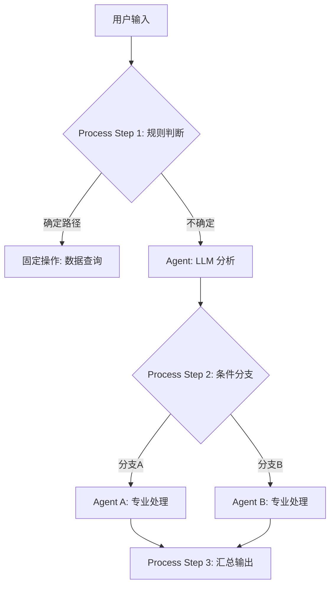

# 📚 AI Agent 项目研究报告 #378 — Microsoft Semantic Kernel：微软企业级 AI 智能体编排中间件

> **报告日期：** 2026-04-17
> **项目地址：** https://github.com/microsoft/semantic-kernel
> **许可证：** MIT
> **GitHub Stars：** 22k+（持续增长中）
> **支持语言：** C# (.NET)、Python、Java
> **首次发布：** 2023 年初，2024 年发布 v1.0 GA

---

## 一、项目概述

### 1.1 什么是 Semantic Kernel

Semantic Kernel（以下简称 SK）是微软开源的**轻量级、模型无关的 AI Agent 开发工具包**。它定位为连接大语言模型与企业现有代码库的"智能中间件"，让开发者能够以最小的代码改动将 LLM 能力嵌入到 C#、Python 或 Java 应用程序中。

与 LangChain 等以 Python 为中心的框架不同，SK 从诞生之初就采用了**多语言优先**策略——C# 和 Python 同步开发、功能对等，后来又补充了 Java 支持。这一设计使其天然适合已有大量 .NET 技术栈的企业组织。

### 1.2 发展历程

- **2023 年初**：微软内部孵化项目，首次公开预览
- **2023-2024 年**：快速迭代，引入 Plugin 系统、Planning 能力、Memory 层
- **2024 年 9 月**：v1.0 正式 GA（General Availability），标志着 API 稳定化承诺
- **2024-2025 年**：引入 Process Framework（流程框架）、MCP 协议支持、多 Agent 编排
- **2025-2026 年**：深度集成 Azure AI 生态，成为 Microsoft 365 Copilot 的底层 SDK 之一

### 1.3 核心定位

SK 不是另一个"LLM 包装器"。它的核心设计哲学是：

> **"不要重写你的代码——让 AI 来调用你已有的代码。"**

这意味着 SK 的 Plugin 系统本质上是一个**函数调用的语义桥接层**：将开发者已有的业务 API/函数，通过语义描述暴露给 LLM，使 LLM 能够自主决定何时调用哪个函数来完成任务。

---

## 二、核心架构

### 2.1 整体架构分层

SK 的架构可以清晰地分为五个核心层：

```
┌─────────────────────────────────────────────┐
│           Application Layer (应用层)          │
│    ChatCompletionAgent / Multi-Agent System   │
├─────────────────────────────────────────────┤
│            Process Framework (流程层)         │
│   Sequential / Parallel / Event-driven Flow   │
├─────────────────────────────────────────────┤
│             Kernel Core (内核层)              │
│   Plugins │ AI Services │ Memory │ Planning   │
├─────────────────────────────────────────────┤
│        Connectors (连接器层)                  │
│  OpenAI │ Azure OpenAI │ HuggingFace │ Ollama │
├─────────────────────────────────────────────┤
│       Infrastructure (基础设施层)             │
│  DI Container │ Telemetry │ Filters │ Hooks   │
└─────────────────────────────────────────────┘
```

### 2.2 Kernel：统一的依赖注入容器

`Kernel` 是 SK 的核心对象，类似于 ASP.NET Core 的 `IServiceProvider`。所有组件通过 Kernel 进行注册和解析：

```csharp
var builder = Kernel.CreateBuilder();
builder.AddAzureOpenAIChatCompletion(deployment, endpoint, apiKey);
builder.Plugins.AddFromType<MenuPlugin>();
builder.Services.AddLogging();
var kernel = builder.Build();
```

Kernel 的关键职责：
- **服务注册**：AI 服务（Chat Completion、Text-to-Image 等）、向量存储、Embedding 服务
- **Plugin 管理**：注册和管理可被 LLM 调用的函数集合
- **依赖注入**：Plugin 可以通过构造函数注入数据库连接、HTTP 客户端等依赖
- **过滤器管道**：请求/响应级别的拦截器（类似 ASP.NET Core 的 Middleware）

### 2.3 Plugin 系统：SK 的灵魂

Plugin 是 SK 最具差异化的概念。一个 Plugin 是一组**语义描述完备的函数集合**，可以被 LLM 通过 Function Calling 自动发现和调用。

#### 三种 Plugin 来源

| 类型 | 说明 | 适用场景 |
|------|------|----------|
| **Native Code Plugin** | 用 C#/Python/Java 原生编写的类，方法标注 `@kernel_function` | 需要访问内部服务的场景 |
| **OpenAPI Plugin** | 从 OpenAPI/Swagger 规范自动生成 | 跨团队共享 REST API |
| **MCP Server Plugin** | 从 MCP Server 动态加载工具 | 与 MCP 生态互操作 |

#### 函数的语义描述体系

每个函数不仅需要实现逻辑，还需要提供完整的语义元数据：

```python
class MenuPlugin:
    @kernel_function(description="Provides a list of specials from the menu.")
    def get_specials(self) -> Annotated[str, "Returns the specials from the menu."]:
        return "Special Soup: Clam Chowder..."
    
    @kernel_function(description="Provides the price of the requested menu item.")
    def get_item_price(
        self, 
        menu_item: Annotated[str, "The name of the menu item."]
    ) -> Annotated[str, "Returns the price of the menu item."]:
        return "$9.99"
```

这种基于注解的声明式描述方式，使得 LLM 能够理解：
- 函数做什么（description）
- 参数含义和类型（Annotated 类型提示）
- 返回值的语义（返回值注释）

#### 函数分类：RAG 函数 vs 任务自动化函数

SK 明确区分了两类 Plugin 函数：

1. **数据检索函数（RAG）**：用于从外部数据源获取信息（如搜索文档、查询数据库），通常配合缓存和摘要策略使用
2. **任务自动化函数**：执行实际操作（如发送邮件、创建订单），通常需要人工审批（Human-in-the-Loop）

### 2.4 Agent 框架

SK v1.0+ 引入了正式的 `ChatCompletionAgent` 抽象：

```python
agent = ChatCompletionAgent(
    service=AzureChatCompletion(),
    name="SK-Assistant",
    instructions="You are a helpful assistant.",
    plugins=[MenuPlugin()],
)
response = await agent.get_response(messages="What is the price of the soup special?")
```

Agent 的核心能力：
- **指令系统（Instructions）**：定义 Agent 的角色和行为边界
- **插件挂载**：Agent 可携带专属的工具集
- **结构化输出**：支持 Pydantic Model / JSON Schema 约束输出格式
- **聊天历史管理**：内置 `ChatHistoryAgentThread` 维护对话上下文

### 2.5 多 Agent 编排

SK 支持将多个 Agent 组合成协作系统。典型模式是**路由分发（Triage）模式**：

```python
billing_agent = ChatCompletionAgent(
    name="BillingAgent",
    instructions="You handle billing issues...",
)

refund_agent = ChatCompletionAgent(
    name="RefundAgent", 
    instructions="Assist users with refund inquiries...",
)

triage_agent = ChatCompletionAgent(
    name="TriageAgent",
    instructions="Evaluate user requests and forward them to BillingAgent or RefundAgent...",
    plugins=[billing_agent, refund_agent],  # 将其他 Agent 作为 Plugin 注入！
)
```

这里的设计非常精妙：**Agent 本身就是 Plugin**。这意味着任何 Agent 都可以作为工具被其他 Agent 调用，实现了真正的递归式 Agent 组合。

### 2.6 Process Framework：结构化工作流引擎

Process Framework 是 SK 区别于大多数 Agent 框架的关键特性。它允许开发者用**声明式方式**定义复杂的多步骤工作流，而不是完全依赖 LLM 自主规划。

核心概念：
- **Process**：由 Steps 组成的有向执行流
- **Step**：可以是一个 Agent 调用、一个条件分支、一个并行执行组
- **支持模式**：顺序执行、并行执行、事件驱动、循环/迭代

这使得 SK 能够处理两类场景：
1. **确定性流程**：如订单处理（审核→支付→发货→通知），每步规则明确
2. **半确定性流程**：如客户服务（分类→转专家→生成回复→人工确认），部分步骤需 LLM 判断

### 2.7 记忆系统（Memory）

SK 提供了分层的记忆抽象：

| 层级 | 实现 | 用途 |
|------|------|------|
| **短期记忆** | ChatHistory | 当前对话上下文 |
| **长期记忆** | Vector Store + Embeddings | 跨会话的知识持久化 |
| **语义记忆** | TextMemoryPlugin | 基于语义相似度的信息检索 |

支持的向量存储后端包括：Azure AI Search、Elasticsearch、Chroma、Qdrant、Milvus、PostgreSQL (pgvector) 等。

---

## 三、技术创新点

### 3.1 "代码即 Plugin"的逆向集成范式

大多数 AI 框架的思路是"把 AI 嵌入代码中"——在 Python 代码里调用 LLM API。SK 反其道而行之：**让 AI 来调用你的代码**。这个看似简单的反转带来了深远影响：

- **零迁移成本**：已有的业务 API 无需改造，只需添加语义注解即可被 AI 发现
- **类型安全**：C# 版本利用编译期类型检查确保 Plugin 接口正确性
- **依赖注入友好**：Plugin 构造函数可以接收任意 DI 注册的服务

### 3.2 函数选择行为控制（FunctionChoiceBehavior）

SK 提供了细粒度的函数调用控制策略：

| 行为 | 说明 |
|------|------|
| `Auto()` | LLM 自动决定是否及何时调用函数 |
| `Required()` | 强制每次响应都调用函数 |
| `None()` | 禁止函数调用（纯对话模式） |

这比简单地将 tools 传给 LLM API 更精细，允许开发者在不同场景下灵活切换策略。

### 3.3 过滤器管道（Filters Pipeline）

受 ASP.NET Core Middleware 启发，SK 实现了一套请求/响应拦截链：

```
用户请求 → [Function Filter Pre] → 函数执行 → [Function Filter Post] → 结果返回
                ↓                         ↓
         [Prompt Filter Pre]      [Prompt Filter Post]
                ↓                         ↓
         [Auto Function Filter]   [Result Filter]
```

实际用途：
- **Prompt Filter**：自动注入安全指令、追加系统提示词
- **Function Filter**：记录函数调用日志、实现权限检查
- **Auto Function Filter**：动态修改可用工具列表（根据用户角色）
- **Result Filter**：过滤敏感信息、审计输出内容

这是企业级场景下**不可观测性和安全性治理**的核心机制。

### 3.4 MCP（Model Context Protocol）原生支持

SK 是最早原生支持 Anthropic MCP 协议的主流框架之一。开发者可以：
- 将外部 MCP Server 作为 Plugin 加载到 Kernel
- 将自己的 Kernel 实例暴露为 MCP Server 供其他应用消费

这使 SK 成为了 MCP 生态系统中的重要枢纽。

### 3.5 Process Framework：混合编排范式

纯 LLM 驱动的 Agent 存在不稳定性和不可预测性问题。纯规则引擎又缺乏灵活性。SK 的 Process Framework 试图融合两者：



这种**"确定性步骤 + LLM 步骤"交替编排**的模式，是 SK 对生产级 Agent 工作流的独特贡献。

### 3.6 多语言同步演进

不同于"Python 优先、其他语言绑定滞后"的常见做法，SK 的 C# 和 Python 实现保持**功能对等、同步发布**。这对企业级采用至关重要——很多大型企业的核心系统是 .NET 技术栈，他们需要一个一等公民级的 AI SDK。

---

## 四、优缺点分析

### 4.1 优点

**① 企业级工程成熟度**
SK 继承了微软在企业软件开发方面的深厚积累。DI 容器、过滤器管道、日志/遥测集成、配置管理等基础设斧行业领先。对于已经使用 .NET 的团队，学习曲线几乎为零。

**② Plugin 系统的设计优雅度**
"函数 + 语义描述"的 Plugin 模型比单纯的 tool/function 列表更符合软件工程的思维习惯。特别是 Native Code Plugin 对依赖注入的支持，使得复杂企业服务的集成变得自然。

**③ 过滤器管道的安全价值**
在生产环境中部署 AI Agent，最大的担忧之一是"AI 会乱来"。SK 的过滤器管道提供了多层拦截能力，可以在不修改业务代码的情况下统一施加安全策略。

**④ 模型无关性的真正落地**
虽然名字里有"Semantic"，但 SK 并不绑定特定模型或供应商。从 OpenAI 到本地 Ollama，从 HuggingFace 到 NVIDIA NIM，切换只需改一行配置。这对于担心供应商锁定（Vendor Lock-in）的企业极具吸引力。

**⑤ Process Framework 填补空白**
大多数 Agent 框架要么是纯 ReAct 循环（太自由），要么是纯 DAG 引擎（太死板）。SK 的 Process Framework 在两者之间找到了有价值的中间地带。

**⑥ 微软生态深度整合**
作为微软官方出品，SK 与 Azure OpenAI、Microsoft 365 Copilot Platform、Azure AI Search 等服务的集成是原生且深度的。对于已经在 Azure 上的企业，这是不二之选。

### 4.2 缺点

**① 学习曲线陡峭**
SK 的概念层级较多：Kernel → Plugin → Function → Agent → Process → Filter。新手容易迷失在这些抽象层之间。相比 SmolAgents 的"三行代码跑起来"体验，SK 的入门门槛明显更高。

**② 文档碎片化**
官方文档分散在 Microsoft Learn 上，URL 结构频繁变动（本次调研中发现多个文档链接 404）。中文社区资源匮乏，大部分高质量内容为英文博客和 Discord 讨论。

**③ Python 生态相对弱势**
尽管 SK 支持 Python，但它的"DNA"仍然是 .NET 的。Python 社区已经有了 LangChain/LangGraph 这个事实标准，SK 在 Python 世界中的存在感有限。很多 Python 开发者会选择 LangGraph 而非 SK。

**④ Process Framework 仍不够成熟**
Process Framework 是较新的特性，API 稳定性不如核心 Kernel。文档覆盖不足，示例代码较少，社区实践案例不多。对于复杂的编排需求，LangGraph 的状态图模型可能更加成熟。

**⑤ 缺乏内置评估工具**
SK 不像 LangSmith 或 AgentOps 那样提供开箱即用的 Agent 评估和调试工具。开发者需要自行搭建测试和监控方案，或者集成第三方平台。

**⑥ 社区活跃度两极分化**
.NET 社区活跃度高，Discord 讨论热烈；但 Java 和 Python 社区的参与度相对较低。跨语言的 bug 修复速度不一致。

---

## 五、应用场景

### 5.1 企业 Copilot 构建
这是 SK 最核心的应用场景。利用 Plugin 系统，企业可以将内部的 ERP、CRM、HR 系统封装为 Plugin，构建面向员工的智能助手。微软自身的 Microsoft 365 Copilot 就是基于 SK 的理念构建的。

### 5.2 多 Agent 客服系统
利用 Triage Agent + Specialist Agent 的路由分发模式，构建智能客服系统。计费问题转给 Billing Agent，退款问题转给 Refund Agent，技术问题转给 Tech Support Agent。

### 5.3 业务流程自动化
结合 Process Framework，将涉及人工判断的业务流程半自动化。例如：采购审批流程中，常规申请自动通过，异常金额触发 LLM 审核并给出建议。

### 5.4 RAG 增强型知识检索
利用 Memory 层和 Vector Store 连接器，构建企业知识库问答系统。Plugin 函数负责从文档存储中检索相关信息，LLM 负责综合回答。

### 5.5 遗留系统集成 AI 能力
对于拥有大量遗留系统的企业（尤其是 .NET 技术栈），SK 提供了一条低成本的 AI 化路径：不需要重构旧系统，只需将已有 API 封装为 Plugin 即可。

---

## 六、与同类项目的横向对比

| 维度 | **Semantic Kernel** | **LangGraph** | **CrewAI** | **OpenAI Agents SDK** | **PydanticAI** |
|------|---------------------|---------------|------------|------------------------|----------------|
| **主要语言** | C# / Python / Java | Python | Python | Python | Python |
| **核心理念** | 中间件/SDK | 状态图编排 | 角色扮演协作 | 轻量手搓 | 类型安全优先 |
| **Plugin 系统** | ⭐⭐⭐⭐⭐ 三种来源 | Tools 定义 | Tools + Roles | function_tooling | 工具函数 |
| **多 Agent** | ⭐⭐⭐⭐ Agent-as-Plugin | ⭐⭐⭐⭐ 图节点 | ⭐⭐⭐⭐⭐ 核心卖点 | ⭐⭐⭐ Handoffs | ⭐⭐ 基础支持 |
| **工作流编排** | ⭐⭐⭐⭐ Process Framework | ⭐⭐⭐⭐⭐ StateGraph | ⭐⭐ Sequential | ⭐⭐ 手动组合 | ⭐ 弱 |
| **企业级设施** | ⭐⭐⭐⭐⭐ DI/Filters/Telemetry | ⭐⭐⭐ LangSmith | ⭐⭐⭐ 基础 | ⭐⭐⭐ | ⭐⭐⭐ |
| **模型灵活性** | ⭐⭐⭐⭐⭐ 广泛支持 | ⭐⭐⭐⭐ 多模型 | ⭐⭐⭐⭐ 多模型 | ⭐⭐ OpenAI only | ⭐⭐⭐ 多模型 |
| **学习曲线** | ⚠️ 较陡 | ⚠️ 中等 | ✅ 平缓 | ✅ 很平缓 | ✅ 平缓 |
| **MCP 支持** | ✅ 原生 | ✅ 社区支持 | ❌ | ✅ 原生 | ❌ |
| **成熟度** | 生产级 (v1.0 GA) | 生产级 | 快速迭代 | 预览版 | 快速迭代 |
| **最佳适用场景** | .NET 企业/Azure 生态 | 复杂状态机工作流 | 角色驱动多 Agent | 快速原型/OpenAI 用户 | 类型安全 Python 项目 |

### 关键差异化总结

- **vs LangGraph**：SK 胜在企业级基础设施（DI、Filters、Telemetry）；LangGraph 胜在状态图编排的表达力和生态丰富度
- **vs CrewAI**：SK 的 Plugin 系统更精细、更适合企业 API 集成；CrewAI 的角色扮演模式更适合创意型和探索型任务
- **vs OpenAI Agents SDK**：SK 是模型无关的，OpenAI SDK 只服务于自家模型；但 OpenAI SDK 更轻量、上手更快
- **vs PydanticAI**：两者都重视类型安全，但 SK 的视野更大（多语言、Process Framework、Memory）

---

## 七、总结评分

### 综合评分：8.4 / 10

| 评分维度 | 得分 | 说明 |
|----------|------|------|
| **技术创新性** | 8.5/10 | Plugin 系统、Filter 管道、Process Framework 均有原创性贡献 |
| **架构设计质量** | 9/10 | 分层清晰、关注点分离优秀、DI 设计值得称道 |
| **易用性** | 7/10 | 概念多、入门门槛较高，但一旦掌握后效率很高 |
| **文档与社区** | 7/10 | .NET 社区强，但整体文档质量不稳定，中文资源少 |
| **企业就绪度** | 9.5/10 | 安全性、可观测性、稳定性承诺均为业界顶尖水平 |
| **生态兼容性** | 8/10 | MCP 原生支持加分，Azure 深度整合强大，但非 Azure 场景稍弱 |
| **发展前景** | 9/10 | 微软全力投入，Copilot 生态背书，长期看好 |

### 一句话总结

**Semantic Kernel 是"企业级 AI Agent 中间件"这一赛道中最成熟的选手。如果你在 .NET/Azure 生态中工作，或者你需要构建要求高可靠性和可观测性的生产级 Agent 系统，SK 应该是你的首选甚至唯一选择。但如果你是纯 Python 团队、追求快速原型验证，LangGraph 或 CrewAI 可能是更顺滑的选择。**

---

> **报告作者：** AI Research Subagent #378  
> **数据截止日期：** 2026-04-17  
> **参考来源：** GitHub Repository (microsoft/semantic-kernel)、Microsoft Learn 官方文档、PyPI/NuGet 包信息
